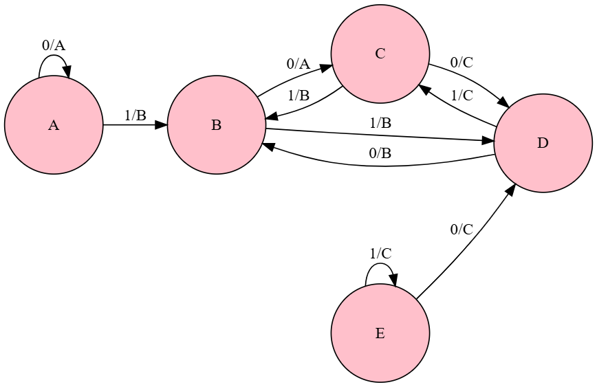
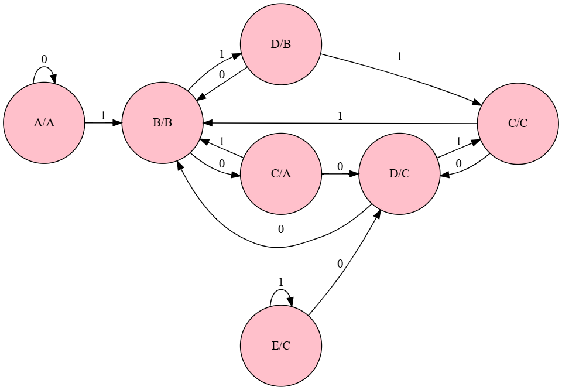

# Automata Theory Lab 2 - Mealy and Moore Machines

## Mealy Machine

## Moore Machine  

## Results
| Input | Output | Final State |
|-------|--------|-------------|
| 00110 | AABBB | B_B |
| 11001 | ABBBC | C_C |
| 1010110 | ABBBBCB | B_B |
| 101111 | ABBBBC | C_C |

## Code
Python implementation available in `moore_machine.py`